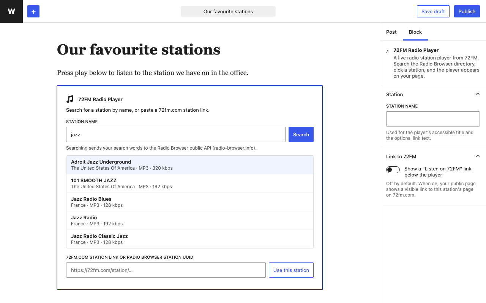

# 72FM Radio Player — WordPress plugin

Add a live radio station player to any WordPress post or page, with a block or a shortcode. Pick from 50,000+ stations in the public [Radio Browser](https://www.radio-browser.info/) directory by searching for the station's name in the block editor.

The player is the free embed from [72FM](https://72fm.com), a web radio player built on that directory: a card with the station's logo, name and a "Listen live" button, 168 px tall and up to 420 px wide. The audio streams straight from the broadcaster's own server.



## Install

1. Download `radio-player-72fm.zip` from the [latest release](https://github.com/AlonDrilich/radio-player-72fm/releases/latest).
2. In WordPress, go to **Plugins → Add New → Upload Plugin**, choose the zip, then **Install Now** and **Activate**.
3. In the block editor, add the **72FM Radio Player** block (under Embeds), search for a station and pick it.

Or use the shortcode anywhere shortcodes work:

```
[radio72 station="https://72fm.com/station/9617a958-0601-11e8-ae97-52543be04c81"]
[radio72 station="9617a958-0601-11e8-ae97-52543be04c81" name="Station name" link="yes"]
```

- `station` (required): the Radio Browser station UUID, or the station's link on 72fm.com.
- `name` (optional): used for the player's accessible title and the link text.
- `link` (optional): `yes` adds a "Listen to … on 72FM" link below the player. **Off by default.**

## Good to know

- 72FM does not own, operate, license or curate any station. Programming, sound quality and any on-air adverts are the broadcaster's.
- The plugin stores nothing, sets no cookies and has no settings page. The player is loaded from 72fm.com; the [readme](radio-player-72fm/readme.txt) ("External services") lists exactly what each service receives.
- Tested with WordPress 7.1 and PHP 8.3; passes the official Plugin Check rule sets.

## License

GPLv2 or later. See [LICENSE](LICENSE).
